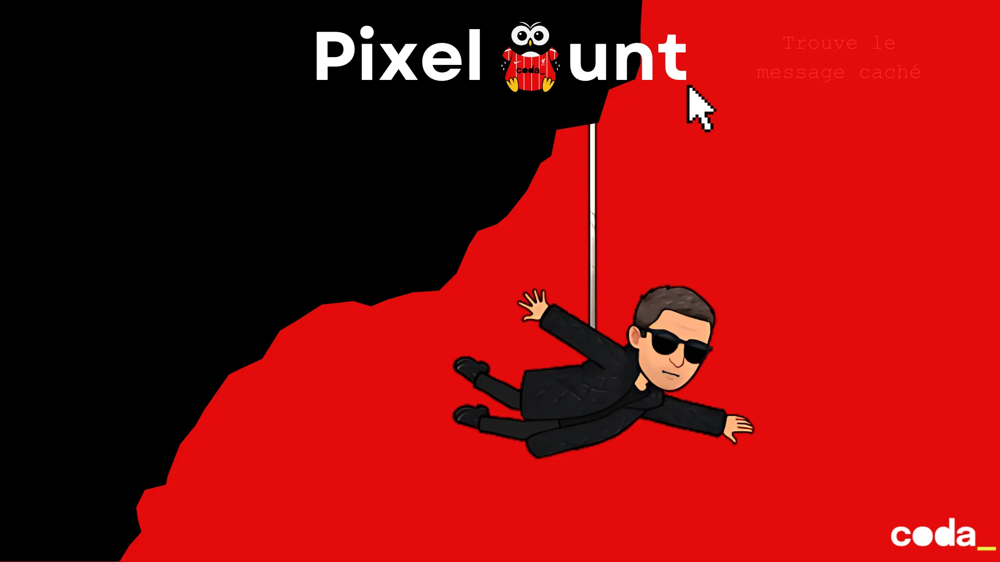

# Pixel Hunt : trouve le message caché !
Tu es un **expert en cybersécurité** et tu viens de récupérer une image suspecte (`encoded.png`) sur un serveur compromis.

Ton équipe a des raisons de croire que cette image contient un **message caché** utilisant la technique de
**stéganographie LSB** (*Least Significant Bit*).

Ta mission :
**Extraire le message caché dans l'image `encoded.png`** en utilisant tes connaissances en programmation et en analyse
binaire.



## Objectifs du Challenge
1. **Comprendre la stéganographie LSB** :
    - Savoir comment un message peut être caché dans les **bits de poids faible** des pixels d'une image.
    - Identifier les outils ou méthodes pour extraire ces informations.

2. **Analyser l'image fournie** :
    - L'image `encoded.png` contient un message caché.
    - Le message est encodé en utilisant la méthode **LSB** (le bit de poids faible de chaque composante RGB des pixels
      est utilisé pour stocker un bit du message).

3. **Écrire un script de décodage** :
    - Implémenter un algorithme pour extraire le message caché.
    - Le message commence par sa **longueur sur 32 bits**, suivie des données binaires du message lui-même.

4. **Retrouver le message secret** :
    - Le message extrait est une **chaîne de caractères ASCII**.
    - Il contient une information cruciale pour la suite de l'enquête.

## Indices et conseils

### **1. Structure du message caché**
- Les **32 premiers bits** de l'image encodent la **longueur du message** (en binaire).
- Les bits suivants contiennent les **données du message** (chaque caractère est encodé sur 8 bits).

### **2. Méthode d'extraction**

- Parcourez les pixels de l'image **de gauche à droite et de haut en bas**.
- Pour chaque pixel, extrayez le **LSB (bit de poids faible)** de chaque composante **Rouge, Vert et Bleu**.
- Reconstituez les bits pour former des octets, puis convertissez-les en caractères ASCII.

> Pour t'aider, la fonction d'encodage est fournie...

```php
/**
 * Encode un message dans une image GD déjà chargée en mémoire.
 * retourne une nouvelle image GD contenant le message caché.
 *
 * @param GdImage $sourceImage Ressource GD de l'image source
 * @param string $secretMessage Message à cacher
 * @return resource
 */
static function encodeMessage(GdImage $sourceImage, string $secretMessage): GdImage
{
    $width = imagesx($sourceImage);
    $height = imagesy($sourceImage);
    $encodedImage = imagecreatetruecolor($width, $height);
    imagecopy($encodedImage, $sourceImage, 0, 0, 0, 0, $width, $height);

    self::writeBinaryLength($secretMessage, $encodedImage);
    self::writeMessage($encodedImage, self::toBinaryMessage($secretMessage), $height, $width);

    return $encodedImage;
}
```

## Livrables Attendus

1. **Un script fonctionnel** capable d'extraire le message caché de `encoded.png`.
2. **Le message décodé** sous forme de texte.
3. **Une brève explication** de ta méthode d'extraction (commentaire dans le code par exemple).